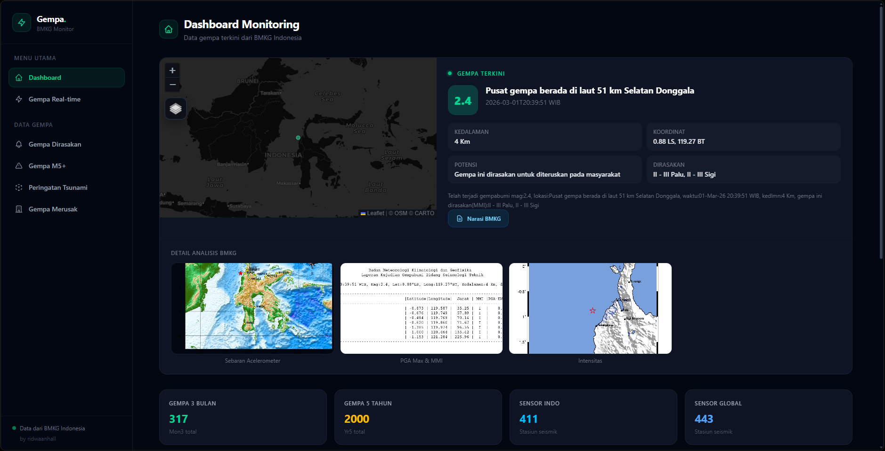

# Gempa Monitor

A modern, responsive web dashboard for monitoring earthquakes in Indonesia, powered by BMKG data. Built with Django, Tailwind CSS, and Leaflet.js.

## Features

- Real-time earthquake data from BMKG
- Interactive maps with recent and historical events
- Filtered views: felt earthquakes, M5+, tsunami alerts, damaging events
- Detailed modals for event analysis and BMKG images
- Responsive design for desktop and mobile
- Clean, component-based UI with Tailwind CSS

## Tech Stack

- Django (Python)
- Tailwind CSS
- Leaflet.js (maps)
- jQuery DataTables

## Structure

- `apps/web/templates/web/` — Page templates and UI components
- `staticfiles/js/` — JavaScript modules for each page
- `staticfiles/css/global.css` — Compiled Tailwind CSS
- `Gempa/` — Django project settings

## Quick Start

1. Install Python dependencies: `pip install -r requirements.txt`
2. Install Node dependencies: `npm install`
3. Build CSS: `npx @tailwindcss/cli -i static/global.css -o staticfiles/css/global.css --minify`
4. Run server: `python manage.py runserver`

## License

MIT
